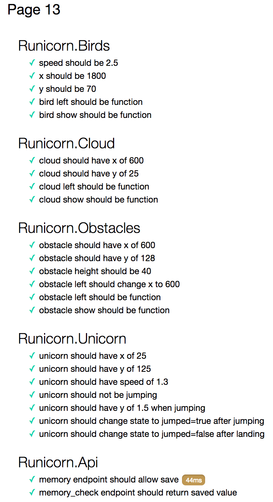

## Runicorn : Page 0 Chapter 1

#### Once upon a time a funny story was written for STARWest and YOU were put in charge. 

#### Will you survive or will you die of dysentery?
*******

Holy Smokes! Who would ever believe that you would finally meet a real live unicorn! Your dumb big brother Billy always made fun of you for believing in magical beasts. If only he could see you now, brushing the beautiful mane of your new best friend Pearlhoof! 

But not all is riding rainbows and brushing manes; Pearlhoof needs to get home before the sun sets and...well, let's be honest. His eyesight is not the greatest. He can run faster then the wind and he can jump as high as the moon. But he can't see trees or birds, and needs your help to get home without making a mess!

You have the magical tools you won from the Gumdrop Fairy. The Golden Bridle and Harness will help you guide Pearlhoof with clarity (AKA switch the acceptance test framework). The murky Purple Potion of Fundamentals will make sure Pearlhoof won't falter unexpectedly (AKA focus on API and Unit tests).

You have to help Pearlhoof find safety, or at least try. Will you guide Pearlhoof with the Golden Harness? Or do you drink the potion to ensure that he's mastered the basics of running and jumping and hope that's enough to get him home?

*******

If you choose to spend one rainbow of effort on "API/Unit Tests": [turn to page 23](../page-23/README.md)

If you choose to spend one rainbow of effort on "Switching Acceptance Test Framework": [turn to page 42](../page-42/README.md)
*******

    
click here to view <b>Execution command</b>

    ./execute.sh

    
click here to view <b>Test Results</b>

    

