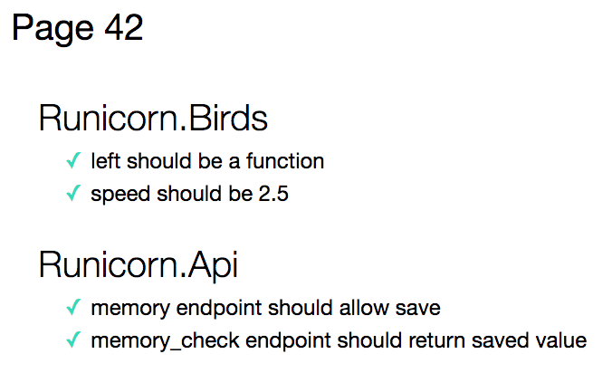

## [Runicorn](../page-0/README.md) >> Page 42 Chapter 2

Acceptance Tests ARE THE BEST!!!

You have chosen to start with focusing your attention on switching to a new framework for these acceptance tests. As non-programmer testers learn selenium, they often write great user flows. However, it takes a while to learn some modern programming practices like maintainability, modularity, design patterns like Page Objects, etc.

After researching with the team, an approach with BDD using Cucumber seemed to make the most sense.  The scenarios and test code are all written in the same codebase with the production code. Everyone can see progress as it happens, and can run the tests at any time.  The scenarios help to drive everyone to a common language, with vocabulary for components and behaviors that is consistent throughout and through different parts of the application.  The scenarios are plain english and business level contributors can both understand and contribute.

Putting this new framework in has taken time, however, and everyone had to learn a new technology.  Not very many tests got re-written in your one rainbow of effort, and some people are questioning whether this was worth it. On one hand, the acceptance level tests now have collective ownership and are much more maintainable. On the other hand, the tests that were written were known to pass, and the team has to convince the business people that they were worth writing anyway. 

These tests are very high level, and do not thoroughly cover many combinations of scenarios. Testing combinations of possible behaviors through the UI is very expensive and involves writing a LOT of code, and also, as lots of these tests are written, they become more brittle, susceptible to application changes and timing issues, and transient failures (even with improved frameworks!).

There is excitement on the team about Cucumber and BDD, and some people want to use it to cover ALL of the tests, including unit tests!  It seems that having one framework to represent all fo the things that are being tested has benefits, so that everyone can see everything that is being tested all in one place.

Other members of the team really want to start putting more focus on beefing up the lower level tests.  They know that while acceptance tests have value, they are only covering so many scnearios. Many combinations of scenarios that should be covered are not.  They know that as the team continues to make changes, some unintended consequences will slip by without being caught. The lower level tests really could be much more significant relative to the acceptance tests.

    
click here to view <b>Test Results</b>

    
    

    
click here to view <b>Execution command</b>

    ./execute.sh

If you choose Start Focusing on Lower Level Tests: [turn to page 8](../page-8/README.md)

If you choose Cucumbers All The Way Down: [turn to page 17](../page-17/README.md)
