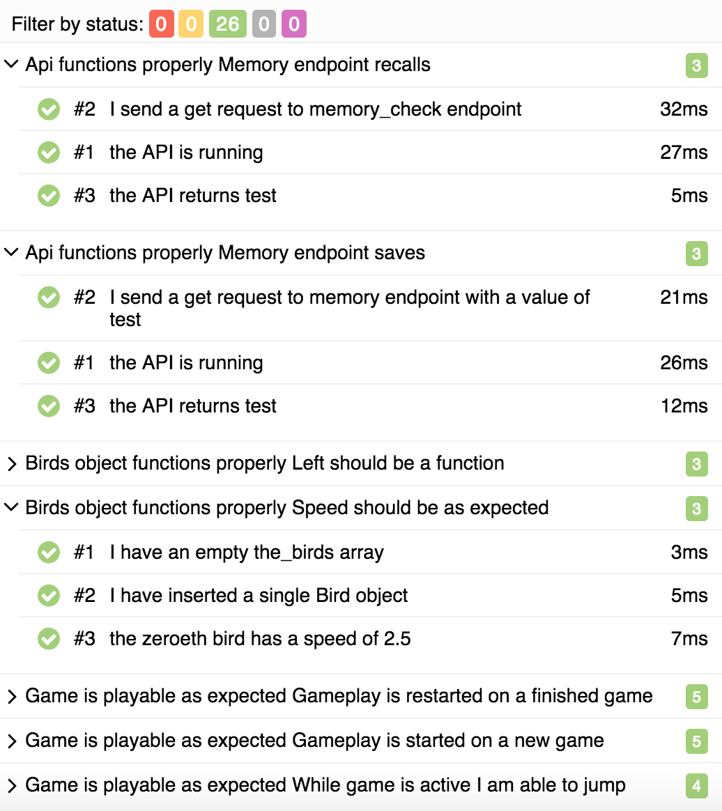

## [Runicorn](../page-0/README.md) >> [Page 23 Chapter 2](../page-23/README.md) >> Page 13 Chapter 3

100% CODE COVERAGE!!

Well, yeah ... but .... 

Your team has now spent 2 rainbows of effort on unit testing alone, and have also chosen to delay resolving the design issues that were identified in the previous steps.  There are higher level tests, although those are still unmaintainable and difficult to work with, not to mention still keep roles somewhat separated.

Some teams really do aim for 100% code coverage, and I'll let you explore Dr. Google to read about why that is a bad idea.  I know of a place where the drive to achieve 100% code coverage was so strongly pushed by management that the test automation team was pushed to write some tests that literally said things like "return true" (with no actual check of anything), or 1=1, etc.

Focusing too much on unit tests sometimes means that valuable time is wasted.  Teams may get too myopic in their vision, spending a lot of time writing tests that are so low level that they miss the higher level needs of the integrations and how the system behaves overall from the user's point of view.  Some unit tests are so difficult to write that teams spend much more time writing significant code just to be able to *run* the test itself.

[2 unit tests, 0 integration tests](https://michelenasti.com/images/unit-testing-1.gif)

Your entire team has been eaten by a [Grue](https://en.wikipedia.org/wiki/Grue_(monster)).

    
click here to view <b>Test Results</b>

    

    
click here to view <b>Execution command</b>

    ./execute.sh

To try again: [turn to page 23](../page-23/README.md)